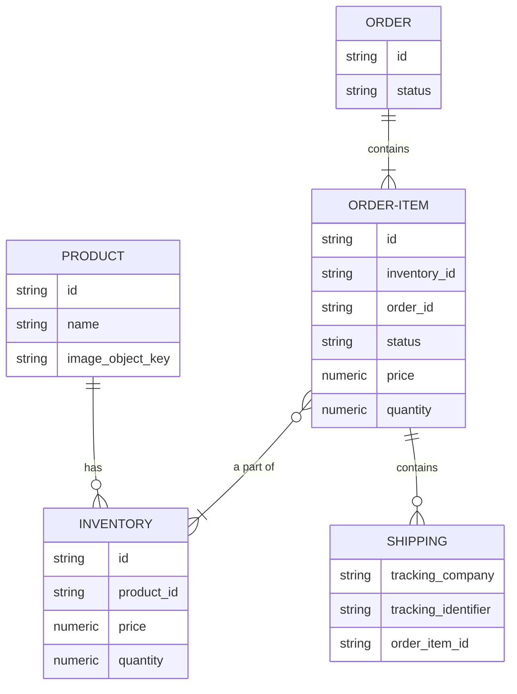

# Technical Design

Technical Design Documentation for Baseline Ecommerce Application.

This document uses [Mermaid](https://mermaid.js.org/intro/) for diagrams. This tool was chosen as it's simple and can be visualized in most IDEs (with use of a plugin) and code hosting websites like GitHub.

## Table of Contents

- [Things Not Considered](#things-not-considered)
- [Requirements](#requirements)
- [Questions](#questions)
- [Overview](#overview)
- [Ecommerce Relational Diagram](#ecommerce-relational-diagram)
- [Services](#services)
  - [Product](#product)
    - [Sequence Diagrams](#sequence-diagrams)
    - [Contracts](#contracts)
    - [APIs](#apis)
  - [Order](#order)
  - [Shipping](#shipping)

## Things Not Considered

* **Authentication**
  * Authentication will not be considered as a part of this exercise.
  * Enhancements for Authentication could include:
    * Including JWT Tokens on all API calls.
    * Token Authorizer to validate signatures with JWK Set on API Calls.
    * Permissions on Token, or retrieved by Authorizer at the time of the call.

## Requirements

* **Baseline product and order management system.**
* **Manage Products:**
  * Must track price and stock quantity.
* **Manage Orders:**
  * Must track products in an order and the quantity of each product.
  * Track status: processing, canceled, delivered.
* **Manage Shipping Information:**
  * e.g., Tracking Company, Tracking Number.

## Questions

- [ ] Do we create the orders ourselves and need to "register" them with a shipping company?
- [ ] Does the vendor update the order, or do we integrate with the vendor's webhooks?
- [ ] Product Inventory: Do we house the products in a central location, or do vendors store inventory?
- [ ] For orders, are we tracking vendors or sellers in the system?

## Overview

There are three levels of ownership with this baseline ecommerce application:

1. **Products**
   * Products are the items being sold in the system.
   * As it's unknown if we have Vendors, Sellers, or both, the term "Owner" will be used moving forward.
   * Products in the system could have different owners selling on the platform, locations being sold from, or general quality. For this reason, a new model "Inventory" has been included to track these additional details for a high-level product.

2. **Orders**
   * Orders track the transaction of an inventory item to a new location.
   * Multiple inventory items could be a part of a larger order. This will be tracked by an order item.
   * To keep this simple, the system will not handle registering orders with a shipping company. Shipping will be "owned" by another system.

3. **Shipping**
   * Shipping tracks the status of an order item to a destination.
   * This area of ownership will be loosely considered as a part of this case study. For time/MVP, this system will only track shipping info at a high level. Additional services could be integrated into this system to collect shipping data, e.g., a Shipping FedEx service meant to integrate with FedEx webhooks to receive updates on shipping.

## Ecommerce Relational Diagram

* Focus on models is to gete core information for a PoC.
    * Eexample of "fluff" fields which are not required for a working PoC include.
        * SKU
        * Quality of Item (for used items)
        * Description



## Services

### Product

#### Sequencee Diagrams

- TODO Finish Digrams for other endpoints.


#### Contracts

* Product Contract

    ```json
    {
        "name": "Chair",
        "id": "UUID",
        "imageObjectKey": "uuid or null",
        "createdAt": "YYYY-MM-DDTHH:MM:SS.sssZ",
        "updatedAt": "YYYY-MM-DDTHH:MM:SS.sssZ",
        "deletedAt": null or "YYYY-MM-DDTHH:MM:SS.sssZ"
    }
    ```

#### APIs

TODO Document other endpoints.

*  POST `/product`
    * Request
        Auditing fields, created & updated at, will be used to verify you have the latest version of the object. Do not modify these fields yourself.

        For creating a new product, you only need to include "name"

        Body
        ```json
        {
            "id": "OPTIONAL - provide to update existing.",
            "name": "REQUIRED",
            "imageObjectKey": "uuid or null",
            "createdAt": "ISO-TIMESTAMP",
            "updatedAt": "ISO-TIMESTAMP",
            "deletedAt": "null or ISO-TIMESTAMP"
        }
        ```
    * Response
        
        On success: 200
        ```json
        {
            "id": "OPTIONAL - provide to update existing.",
            "name": "REQUIRED",
            "imageObjectKey": "uuid or null",
            "createdAt": "ISO-TIMESTAMP",
            "updatedAt": "ISO-TIMESTAMP",
            "deletedAt": "null or ISO-TIMESTAMP"
        }
        ```

        On Failure: 400 (This payload is outdated)
        ```json
        {
          "message": "<Message for user on why an error occured.>",
          "timestamp": "<time.Now().UTC().Format(time.RFC3339)>"
        }
        ```

        On Failure: 500 (This payload is outdated)
        ```json
        {
          "message": "Internal Server Error.",
          "timestamp": "<time.Now().UTC().Format(time.RFC3339)>"
        }
        ```


*  GET `/product`
    * Request

        Query Params
        * page: Page number to return.
        * page_size: Size of page to return.
        * name: Filter by name.
        * sort_by: Field to sort by. ("name", "created_at", "updated_at")
        * sort: Sort direction. ("asc" | "desc")

    * Response
        
        On success: 200
        ```json
        {
            "countTotal": 0,
            "count": 0,
            "page": {
                "page": 0,
                "pageSize": 0,
                "initialPage": 0,
                "totalpages": 0,  
            },
            "sort": {
                "sortBy": 0,
                "sortOrder": 0,
            },
            "query": {
                "name": "EQUALS QUERY PARAMS IF PROVIDED. ELSE UNDEFINED"
            },
            "data": [
                {
                    "id": "",
                    "name": "",
                    "imageObjectKey": "uuid or null",
                    "imageUrl": "url or null",
                    "createdAt": "ISO-TIMESTAMP",
                    "updatedAt": "ISO-TIMESTAMP"
                }
            ]
        }
        ```

        On Failure: 400 (This payload is outdated)
        ```json
        {
          "message": "<Message for user on why an error occured.>",
          "timestamp": "<time.Now().UTC().Format(time.RFC3339)>"
        }
        ```

        On Failure: 500 (This payload is outdated)
        ```json
        {
          "message": "Internal Server Error.",
          "timestamp": "<time.Now().UTC().Format(time.RFC3339)>"
        }
        ```

### Order

TODO - Fill out secton.

### Shipping

TODO - Fill out secton.